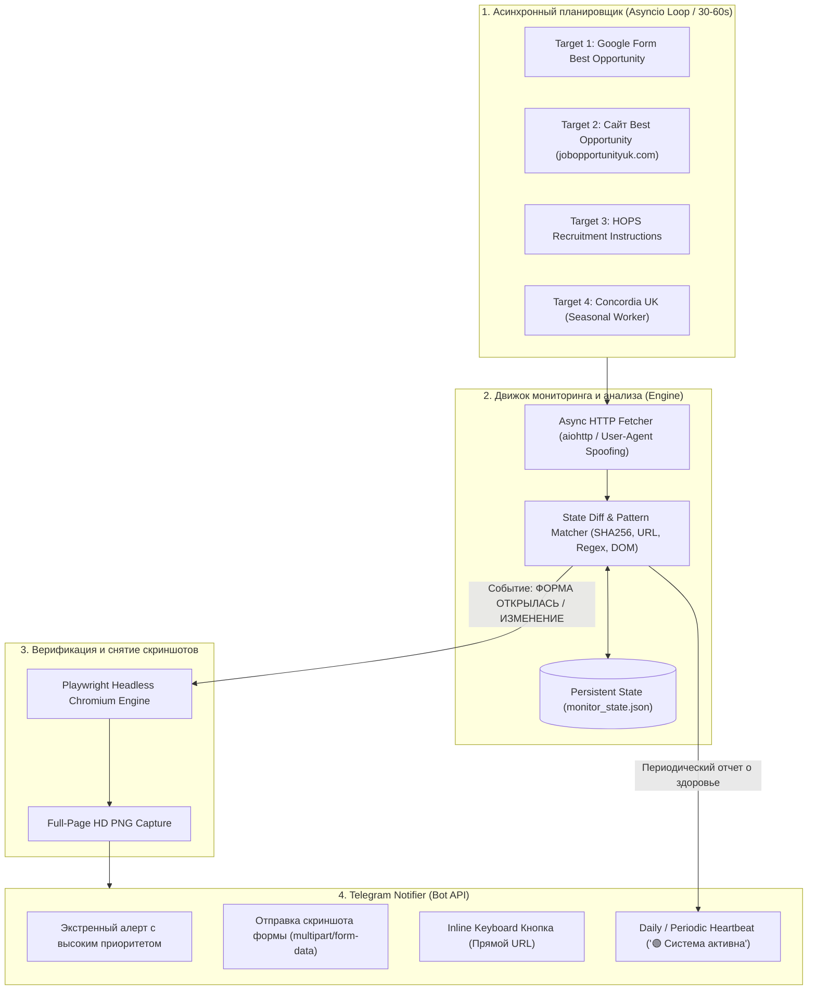

# Архитектура и спецификация: SWS Telegram Monitor Bot (UK Seasonal Worker Scheme)

---

## 1. Анализ существующих решений и Best Practices

### Обзор существующих инструментов в индустрии:
1. **Changedetection.io:**
   * *Плюсы:* Мощный self-hosted инструмент для отслеживания изменений текста/HTML.
   * *Минусы:* Тяжеловесный для одной задачи, не имеет специализированной логики детекции статусов Google Forms (редирект `/closedform` -> `/viewform`), не умеет на лету парсить специфические ключевые слова и отправлять интерактивные inline-кнопки с прямым переходом в Telegram.
2. **AutoGFormBot / Custom Google Scripts:**
   * *Плюсы:* Легковесность.
   * *Минусы:* Google Apps Script требует доступа владельца формы (у нас форма внешняя).
3. **Наше решение (Custom Async High-Precision Monitor):**
   * **Двухуровневая гибридная детекция (Fast HTTP + Headless Playwright):**
     * **Уровень 1 (Fast-Check / 10–30s):** Сверхбыстрый асинхронный HTTP-опрос (`aiohttp` / `httpx`) заголовков, истории редиректов (302/303 -> `/closedform`), хэшей контента (SHA-256) и DOM-структуры. Минимальное потребление CPU и трафика.
     * **Уровень 2 (Visual Verification & Screenshot):** При фиксации изменения статуса моментально запускается изолированный headless-браузер **Playwright Chromium** с эмуляцией реального пользователя (*Stealth User-Agent*), делает полноэкранный скриншот высокого разрешения и перепроверяет интерактивность полей ввода.
   * **Мгновенное оповещение (Telegram Bot API):** Отправка фото открывшейся формы + экстренный звуковой пуш + инлайн-кнопка `🚀 Открыть анкету прямо сейчас` для перехода в 1 клик с телефона.

---

## 2. Диаграмма архитектуры системы



---

## 3. Мониторинг целей и алгоритмы детекции

| Цель | URL | Критерии срабатывания тревоги (ALERT) |
| :--- | :--- | :--- |
| **1. Best Opportunity Google Form** | `https://forms.gle/kkdrh8aNPQNHQkCk8` | 1. URL больше **НЕ содержит `/closedform`** (переход на `/viewform`).<br>2. Исчез текст *"Nu mai acceptă răspunsuri"* / *"No longer accepting responses"*.<br>3. Появились активные поля ввода `<form>` или `<input>`. |
| **2. Сайт Best Opportunity** | `https://www.jobopportunityuk.com/` | 1. Появление новой ссылки на Google Form / Jotform.<br>2. Изменение секции `/recrutare` или встроенного iframe формы.<br>3. Изменение SHA-256 хэша контента. |
| **3. HOPS Instructions** | `https://www.hopslaboursolutions.com/recruitment-instructions` | 1. Появление ключевых слов: `"Moldova"`, `"Молдова"`, `"Регистрация откроется"`, `"Apply Now"`.<br>2. Появление новых ссылок на регистрационные формы (Google Forms, The Gateway, Global-Workforce).<br>3. Изменение структуры страницы. |
| **4. Concordia UK** | `https://www.concordia.org.uk/` | 1. Изменение статуса страницы сезонного набора.<br>2. Появление ссылок на подачу заявок на новый сезон. |

---

## 4. Структура репозитория (Production Ready)

```text
sws_monitor_bot/
├── .env.example                 # Шаблон переменных окружения
├── .gitignore                   # Исключение секретов, логов и кэша
├── Dockerfile                   # Оптимизированный образ на базе python:3.12-slim с Chromium
├── docker-compose.yml           # Декларативный запуск с автоперезапуском и монтированием томов
├── requirements.txt             # Зафиксированные production-зависимости
├── README.md                    # Инструкция по установке, настройке и запуску
├── data/                        # Том для хранения состояния и скриншотов
│   ├── monitor_state.json       # Персистентное состояние и хэши
│   └── screenshots/             # Снятые скриншоты алертов
└── src/
    ├── __init__.py
    ├── config.py                # Pydantic Settings конфигурация (валидация типов)
    ├── logger.py                # Структурированное логирование (консоль + файл с ротацией)
    ├── models.py                # Датаклассы состояний, целей и алертов
    ├── browser.py               # Асинхронный Playwright-браузер для скриншотов
    ├── notifier.py              # Telegram API клиент (фотографии, разметка HTML, кнопки)
    ├── detectors/               # Модульные детекторы для каждой цели
    │   ├── __init__.py
    │   ├── base.py              # Базовый интерфейс детектора
    │   ├── google_forms.py      # Детектор Google Forms (URL + DOM)
    │   ├── hops.py              # Детектор HOPS (ссылки + регулярные выражения)
    │   ├── best_opportunity.py  # Детектор сайта Best Opportunity
    │   └── concordia.py         # Детектор сайта Concordia
    ├── engine.py                # Ядро опроса, планировщик и обработка сбоев
    └── main.py                  # Точка входа, обработка сигналов (SIGINT/SIGTERM), CLI-флаг --test
```

---

## 5. Спецификация Docker & Развертывания

* **Base Image:** `python:3.12-slim-bookworm` + установка системных зависимостей для Playwright Chromium (`libnss3`, `libatk1.0-0`, `libx11-xcb1`, и т.д.).
* **Docker Compose:**
  * `restart: always` (автоматический перезапуск при сбоях сервера).
  * `volumes:` монтирование папки `./data` для сохранения `monitor_state.json` и скриншотов при перезапуске контейнера.
  * `environment:` передача токена бота и Chat ID.
* **Безопасность:**
  * Запуск без root-прав (non-root user).
  * Никаких захардкоженных токенов в коде (строго через `.env`).
