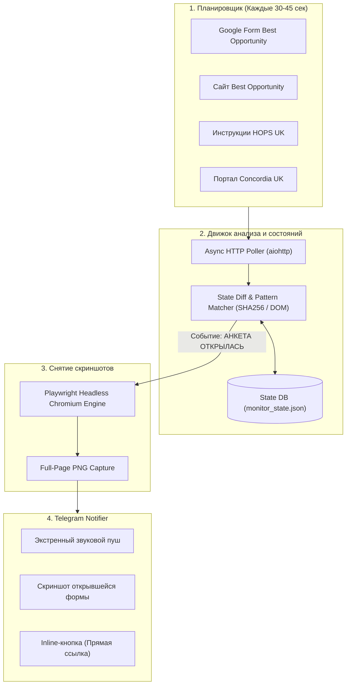

# 🇬🇧 SWS Application Watcher & Telegram Alert Bot

> **Высокоточный асинхронный бот для непрерывного мониторинга открытия форм подачи заявок на сезонную работу в Великобритании (Seasonal Worker Scheme 2026/2027)**.
> Мгновенно фиксирует открытие Google Forms, изменение страниц операторов (HOPS, Concordia, Best Opportunity), делает скриншот и отправляет экстренное уведомление с инлайн-кнопкой в Telegram.

---

## 🌟 Ключевые возможности

* ⚡ **Сверхбыстрый асинхронный опрос (30–45 сек):** Неблокирующий `asyncio` + `aiohttp` с пулом соединений и эмуляцией реального браузера (*User-Agent Spoofing*).
* 🎯 **Специализированные детекторы для 4 ключевых целей:**
  1. **Best Opportunity Google Form:** Мгновенно отслеживает смену статуса с `/closedform` (*"Nu mai acceptă răspunsuri"*) на рабочую форму `/viewform` с полями ввода.
  2. **Сайт Best Opportunity (`jobopportunityuk.com`):** Детектирует появление новых ссылок на формы регистрации, iframe-встроек и анонсов набора.
  3. **HOPS Labour Solutions (`hopslaboursolutions.com/recruitment-instructions`):** Сканирует появление регистрационных ссылок (*The Gateway, Google Forms*), а также упоминаний Молдовы и дат открытых окон.
  4. **Concordia UK (`concordia.org.uk`):** Отслеживает появление порталов регистрации на новый сезон.
* 📸 **Автоматические скриншоты высокой четкости:** Встроенный движок **Playwright Chromium** моментально делает снимок страницы при открытии формы и прикрепляет его к сообщению в Telegram.
* 🚨 **Telegram Bot API с Inline-кнопками:** Присылает тревожное оповещение со звуком, описанием изменений и большой кнопкой `🚀 Открыть анкету прямо сейчас` для подачи с телефона в 1 клик.
* 🛡️ **Отказоустойчивость и безопасность:** Персистентное сохранение состояния в `data/monitor_state.json`, автоматический перезапуск при сетевых сбоях, периодический Heartbeat-отчет о работоспособности.
* 🐳 **Готовность к Docker и Docker Compose:** Изолированный контейнер с установленным Chromium и автоматическим перезапуском (*restart: always*).

---

## 🏗 Архитектура системы



---

## 🚀 Быстрый старт (Локально)

### 1. Клонирование и настройка окружения:
```bash
git clone https://github.com/booowieee/england-bot-watcher.git
cd england-bot-watcher
python -m venv venv
# Windows:
venv\Scripts\activate
# Linux/macOS:
source venv/bin/activate

pip install -r requirements.txt
playwright install chromium
```

### 2. Конфигурация `.env`:
Создайте файл `.env` на основе `.env.example`:
```ini
TELEGRAM_BOT_TOKEN=123456789:ABCdefGHIjklMNOpqrSTUvwxYZ
TELEGRAM_CHAT_ID=123456789
CHECK_INTERVAL_SECONDS=45
HEARTBEAT_INTERVAL_HOURS=12
ENABLE_SCREENSHOTS=true
DEBUG_MODE=false
```
> 💡 *Токен бота создается в [@BotFather](https://t.me/BotFather), а ваш Chat ID можно узнать в [@userinfobot](https://t.me/userinfobot).*

### 3. Запуск диагностики и тестов:
```bash
python -m src.main --test
```

### 4. Запуск в режиме непрерывного мониторинга:
```bash
python -m src.main
```

---

## 🐳 Развертывание через Docker Compose (Рекомендуется для сервера / VPS)

### 1. Запуск в фоновом режиме:
```bash
docker-compose up -d --build
```

### 2. Просмотр логов:
```bash
docker-compose logs -f
```

### 3. Остановка:
```bash
docker-compose down
```

---

## 📁 Структура проекта

```text
sws_monitor_bot/
├── .env.example                 # Шаблон настроек
├── .gitignore                   # Исключение секретов и кэша
├── Dockerfile                   # Docker-образ с поддержкой Chromium
├── docker-compose.yml           # Декларативный запуск
├── requirements.txt             # Зависимости Python
├── README.md                    # Документация
├── data/                        # Персистентные данные
│   ├── monitor_state.json       # Сохраненные хэши и статусы
│   └── screenshots/             # Снятые скриншоты алертов
└── src/
    ├── config.py                # Загрузчик конфигурации
    ├── logger.py                # Структурированное логирование
    ├── models.py                # Датаклассы и модели данных
    ├── browser.py               # Playwright скриншотер
    ├── notifier.py              # Telegram клиент (фото + кнопки)
    ├── detectors/               # Модульные детекторы целей
    │   ├── base.py              # Базовый класс
    │   ├── google_forms.py      # Детектор Google Forms (/closedform -> /viewform)
    │   ├── hops_detector.py     # Детектор HOPS (ссылки + ключевые слова)
    │   ├── best_opp_web.py      # Детектор сайта Best Opportunity
    │   └── concordia.py         # Детектор сайта Concordia
    ├── engine.py                # Ядро мониторинга и diff-движок
    └── main.py                  # Точка входа и обработка сигналов
```

---

## 📄 Лицензия
MIT License. Создано для мониторинга сезонных программ Великобритании.
