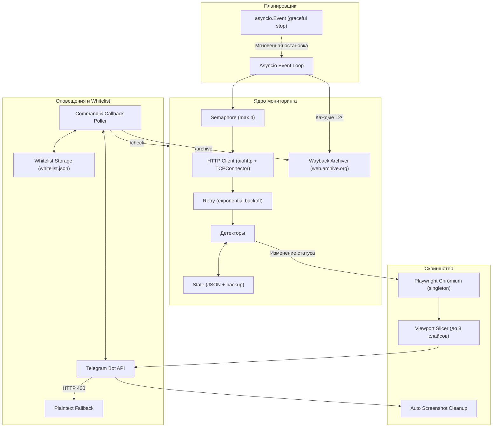

# England SWS Watcher


Асинхронный сервис мониторинга сайтов визовых операторов UK Seasonal Worker Scheme с мгновенной отправкой уведомлений со скриншотом в Telegram при открытии регистрационных форм, интерактивным управлением через команды, динамической системой раздачи доступа и автоматической архивацией в Wayback Machine.

---

## Возможности

- **Асинхронный мониторинг:** опрос целевых ресурсов через `asyncio` + `aiohttp` с пулом соединений и retry (exponential backoff).
- **Специализированные детекторы:** для Google Forms, Best Opportunity, HOPS Labour Solutions и Concordia UK.
- **Скриншоты и защита диска:** рендеринг через headless Playwright Chromium (singleton) с автоматическим разбиением длинных страниц на читаемые слайсы и удалением файлов сразу после отправки.
- **Автоматическая архивация в Wayback Machine (web.archive.org):**
  - Бот автоматически 2 раза в сутки (каждые 12 часов) отправляет целевые страницы в глобальный веб-архив Internet Archive для сохранения истории изменений.
  - Ручной запуск архивации в любой момент по команде `/archive`.
- **Динамический контроль доступа (Whitelist & Approval):**
  - Неавторизованный пользователь при отправке `/start` отправляет заявку администратору.
  - Администратор получает интерактивное сообщение с кнопками `[Одобрить]` и `[Отклонить]`.
  - Одобренные пользователи сохраняются в `data/whitelist.json` и автоматически получают все алерты и доступ к командам.
- **Интерактивные команды:**
  - `/status` — вывод актуального статуса всех целей.
  - `/check` — принудительный запуск внеочередной проверки со скриншотами.
  - `/archive` — принудительная отправка всех целевых страниц в Wayback Machine.
  - `/users` — просмотр списка пользователей с доступом (для админа).
  - `/revoke <id>` — отзыв доступа у пользователя.
  - `/add <id>` — добавление пользователя вручную.
- **Отказоустойчивость:** атомарная персистенция состояния с автоматическим бэкапом, graceful shutdown по `SIGINT` / `SIGTERM`.

---

## Архитектура



Подробное описание компонентов, детекторов и механизмов отказоустойчивости: [docs/architecture.md](./docs/architecture.md).

---

## Стек

| Категория | Технология | Назначение |
|-----------|-----------|------------|
| Язык | Python 3.12+ | Асинхронная логика мониторинга |
| HTTP | aiohttp | Неблокирующий клиент с пулом соединений |
| Архивация | Wayback Machine API | Сохранение снимков страниц в web.archive.org |
| Браузер | Playwright Chromium | Headless-скриншоты с блокировкой тяжелых ресурсов |
| Парсинг | BeautifulSoup4 | Анализ DOM и извлечение ссылок |
| Оповещения | Telegram Bot API | Рассылка алертов, инлайн-кнопки и интерактивный whitelist |
| Контейнеризация | Docker Compose | Изоляция, автоперезапуск, volume-монтирование |

---

## Отслеживаемые ресурсы

| Ресурс | URL | Логика детекции |
|--------|-----|-----------------|
| Best Opportunity Form | `forms.gle/kkdrh8aNPQNHQkCk8` | Редирект `/closedform` -> `/viewform`, проверка полей ввода |
| Best Opportunity Web | `jobopportunityuk.com` | Новые ссылки на формы, изменение iframe, хэш страницы |
| HOPS Instructions | `hopslaboursolutions.com/recruitment-instructions` | Ссылки на регистрацию, структурные изменения контента |
| Concordia UK | `concordia.org.uk` | Изменение ссылок на форму набора |

---

## Команды Telegram

| Команда | Доступ | Описание |
|---------|--------|----------|
| `/status` | Все одобренные | Выводит актуальный статус отслеживания по всем 4 ресурсам |
| `/check` | Все одобренные | Принудительно запускает полный цикл проверки со скриншотами |
| `/archive` | Все одобренные | Принудительно сохраняет все целевые страницы в Wayback Machine |
| `/help` | Все одобренные | Показывает список доступных команд |
| `/users` | Администратор | Выводит список всех пользователей в белом списке |
| `/revoke <id>` | Администратор | Отзывает доступ у пользователя по ID |
| `/add <id>` | Администратор | Вручную добавляет ID пользователя в белый список |

---

## Быстрый старт

**Клонирование и установка:**
```bash
git clone https://github.com/booowieee/england-bot-watcher.git
cd england-bot-watcher

python -m venv venv
source venv/bin/activate  # Windows: venv\Scripts\activate

pip install -r requirements.txt
playwright install chromium
```

**Конфигурация:**
```bash
cp .env.example .env
# Заполнить TELEGRAM_BOT_TOKEN, TELEGRAM_CHAT_ID и TELEGRAM_ADMIN_ID
```

**Диагностика:**
```bash
python -m src.main --test
```

**Запуск:**
```bash
python -m src.main
```

---

## Docker Compose

```bash
docker compose up -d --build    # сборка и запуск
docker compose logs -f          # логи
docker compose down             # остановка
```

---

## Структура проекта

```text
england-bot-watcher/
├── docs/
│   └── architecture.md
├── data/
│   ├── monitor_state.json
│   ├── whitelist.json
│   └── screenshots/
├── logs/
├── src/
│   ├── detectors/
│   │   ├── base.py
│   │   ├── google_forms.py
│   │   ├── hops_detector.py
│   │   ├── best_opp_web.py
│   │   └── concordia.py
│   ├── archiver.py
│   ├── browser.py
│   ├── config.py
│   ├── engine.py
│   ├── logger.py
│   ├── models.py
│   ├── notifier.py
│   ├── whitelist.py
│   └── main.py
├── .env.example
├── .gitignore
├── Dockerfile
├── docker-compose.yml
├── requirements.txt
├── LICENSE
└── README.md
```

---

## Лицензия

MIT License. См. [LICENSE](LICENSE).
