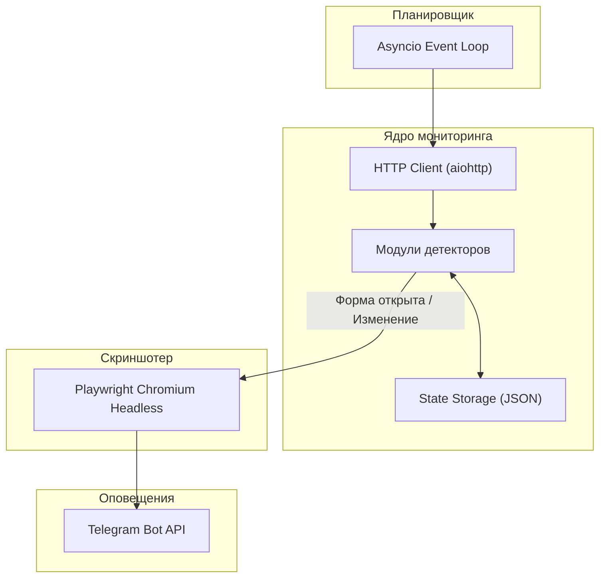

# England SWS Watcher


Асинхронный сервис для непрерывного мониторинга сайтов британских визовых операторов схемы сезонных рабочих (UK Seasonal Worker Scheme) и моментальной отправки уведомлений со скриншотом в Telegram при открытии регистрационных анкет.

---

## Ключевые возможности

- **Асинхронный опрос в реальном времени:**
  - Неблокирующий цикл на базе `asyncio` и `aiohttp` с интервалом проверки от 30 секунд.
  - Эмуляция заголовков современного браузера для предотвращения ложных блокировок со стороны WAF.
- **Специализированные детекторы:**
  - **Google Forms:** отслеживание редиректов (`/closedform` -> `/viewform`) и анализ DOM на появление интерактивных полей ввода.
  - **Best Opportunity Website:** мониторинг главной страницы и раздела `/recrutare` на появление новых ссылок и iframe-форм.
  - **HOPS Labour Solutions:** regex-сканирование страницы инструкций по набору на предмет упоминания стран, дат набора и прямых ссылок на регистрационные порталы (*The Gateway*, *Global-Workforce*).
  - **Concordia UK:** отслеживание обновлений страницы сезонного набора.
- **Визуальное подтверждение и скриншоты:**
  - Автоматический рендеринг страницы через headless-браузер **Playwright Chromium** при фиксации события открытия формы.
  - Сохранение полноэкранного снимка высокого разрешения в локальный каталог `data/screenshots/`.
- **Оповещения в Telegram:**
  - Отправка экстренного сообщения со скриншотом и подробным описанием изменений.
  - Интерактивная inline-кнопка для быстрого перехода к открывшейся анкете в один клик.
  - Периодический отчет о статусе работы сервиса (Heartbeat).
- **Отказоустойчивость:**
  - Атомарное сохранение состояния в `data/monitor_state.json`.
  - Корректная обработка сетевых сбоев и таймаутов без падения процесса.
  - Поддержка мягкой остановки (graceful shutdown) по сигналам `SIGINT` и `SIGTERM`.

---

## Архитектура



Подробное описание архитектуры, детекторов и алгоритмов сравнения приведено в файле [docs/architecture.md](./docs/architecture.md).

---

## Стек технологий

| Категория | Технология | Версия | Назначение |
|-----------|-----------|--------|------------|
| Язык | Python | 3.12+ | Основной язык разработки |
| Асинхронность | Asyncio, aiohttp | 3.10+ | Неблокирующий HTTP-клиент и цикл событий |
| Браузерный движок | Playwright (Chromium) | 1.46+ | Снятие полноэкранных скриншотов |
| Парсинг HTML | BeautifulSoup4 | 4.12+ | Анализ DOM-структуры и извлечение ссылок |
| Оповещения | Telegram Bot API | latest | Доставка алертов с фото и кнопками |
| Контейнеризация | Docker, Docker Compose | latest | Изоляция окружения и автоперезапуск |

---

## Отслеживаемые ресурсы

| Ресурс | URL | Логика детекции |
|--------|-----|-----------------|
| Best Opportunity Google Form | `https://forms.gle/kkdrh8aNPQNHQkCk8` | Смена URL на `/viewform`, исчезновение текста закрытой формы, появление полей ввода |
| Best Opportunity Web | `https://www.jobopportunityuk.com/` | Появление новых ссылок на Google Forms, изменение iframe или хэша страницы |
| HOPS Recruitment Instructions | `https://www.hopslaboursolutions.com/recruitment-instructions` | Появление ссылок на регистрацию, regex-совпадения по странам и датам набора |
| Concordia UK Portal | `https://www.concordia.org.uk/` | Изменение ссылок на форму сезонного набора |

---

## Быстрый старт

### 1. Клонирование репозитория:
```bash
git clone https://github.com/booowieee/england-bot-watcher.git
cd england-bot-watcher
```

### 2. Настройка виртуального окружения:
```bash
python -m venv venv

# Windows:
venv\Scripts\activate

# Linux / macOS:
source venv/bin/activate

pip install -r requirements.txt
playwright install chromium
```

### 3. Конфигурация:
Создайте файл `.env` на основе шаблона `.env.example`:
```ini
TELEGRAM_BOT_TOKEN=123456789:ABCdefGHIjklMNOpqrSTUvwxYZ
TELEGRAM_CHAT_ID=123456789
CHECK_INTERVAL_SECONDS=45
HEARTBEAT_INTERVAL_HOURS=12
ENABLE_SCREENSHOTS=true
DEBUG_MODE=false
```

### 4. Тестовый прогон (Диагностика):
```bash
python -m src.main --test
```

### 5. Запуск в рабочем режиме:
```bash
python -m src.main
```

---

## Развертывание в Docker Compose

Для круглосуточной работы на сервере или VPS рекомендуется использовать Docker Compose.

```bash
# Сборка и фоновый запуск
docker-compose up -d --build

# Просмотр логов в реальном времени
docker-compose logs -f

# Остановка контейнера
docker-compose down
```

---

## Структура проекта

```text
england-bot-watcher/
├── docs/
│   └── architecture.md          # Подробное описание архитектуры и логики
├── data/                        # Хранилище состояния и скриншотов
│   ├── monitor_state.json       # Персистентное состояние целей
│   └── screenshots/             # Сохраненные снимки экранов
├── logs/                        # Ротируемые журналы работы
├── src/
│   ├── detectors/               # Модульные детекторы целевых сайтов
│   │   ├── base.py              # Базовый интерфейс детектора
│   │   ├── google_forms.py      # Детектор статуса Google Forms
│   │   ├── hops_detector.py     # Детектор HOPS UK
│   │   ├── best_opp_web.py      # Детектор сайта Best Opportunity
│   │   └── concordia.py         # Детектор сайта Concordia UK
│   ├── browser.py               # Playwright скриншотер
│   ├── config.py                # Загрузка и валидация конфигурации
│   ├── engine.py                # Ядро мониторинга и планировщик
│   ├── logger.py                # Настройка логирования
│   ├── models.py                # Модели данных и типы
│   ├── notifier.py              # Клиент Telegram Bot API
│   └── main.py                  # Точка входа в приложение
├── .env.example                 # Шаблон переменных окружения
├── .gitignore                   # Правила исключения файлов из git
├── Dockerfile                   # Описание Docker-образа
├── docker-compose.yml           # Конфигурация Docker Compose
├── requirements.txt             # Список зависимостей Python
└── README.md                    # Документация проекта
```

---

## Лицензия

MIT License. См. [LICENSE](LICENSE) для подробностей.
