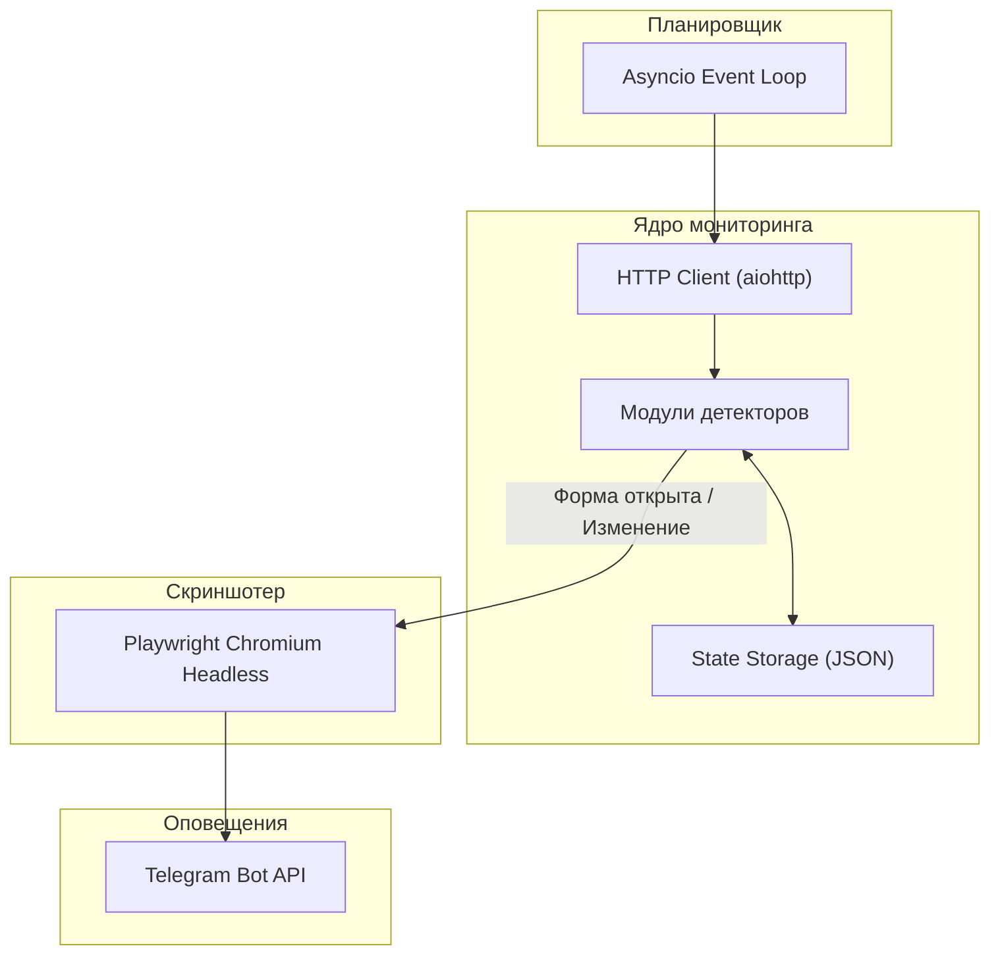

# Архитектура SWS Watcher

Документ описывает внутреннюю структуру, алгоритмы детекции и логику работы компонентов сервиса мониторинга.

---

## 1. Общая схема

Сервис построен на базе асинхронного цикла событий `asyncio`. Опрос целевых ресурсов выполняется параллельно через неблокирующий HTTP-клиент `aiohttp` с пулом соединений и эмуляцией заголовков браузера.



---

## 2. Компоненты системы

### HTTP Poller и Rate Limiting
* Опрос запускается каждые `N` секунд (настраивается через `CHECK_INTERVAL_SECONDS`).
* Для каждого запроса выставляются стандартные заголовки современного браузера (`User-Agent`, `Accept-Language`, `Cache-Control: no-cache`).
* В случае временных сетевых сбоев (таймаут, 5xx) ошибка логируется, сервис делает паузу и повторяет попытку в следующем цикле без падения процесса.

### Модульные детекторы (`src/detectors/`)
Каждый целевой сайт обрабатывается специализированным классом-детектором:

1. **Google Forms (`GoogleFormsDetector`):**
   * Анализирует конечный URL после прохождения цепочки редиректов.
   * Сравнивает наличие признаков закрытой формы (`/closedform`, текст `nu mai accepta raspunsuri` / `no longer accepting responses`).
   * Проверяет наличие интерактивных полей ввода в DOM (`input[type=text]`, `textarea`, `div[role=listitem]`).
   * Статус считается `OPEN`, если редирект ведет на `/viewform` и в DOM присутствуют активные элементы формы.

2. **Best Opportunity Website (`BestOpportunityWebDetector`):**
   * Парсит HTML главной страницы и блока `/recrutare`.
   * Извлекает ссылки на внешние формы (`forms.gle`, `docs.google.com`, `jotform`) и встроенные `iframe`.
   * Считает SHA-256 хэш текстового содержимого.
   * Триггерит событие при появлении новых ссылок на регистрацию.

3. **HOPS Instructions (`HopsDetector`):**
   * Сканирует страницу инструкций по набору на предмет появления прямых ссылок на регистрационные порталы (*The Gateway*, *Global-Workforce*, *Google Forms*).
   * Выполняет regex-поиск по ключевым словам (`Moldova`, `Молдова`, `онлайн-регистрация откроется`, `apply now`).
   * Отслеживает изменения хэша текста страницы.

4. **Concordia UK (`ConcordiaDetector`):**
   * Отслеживает появление ссылок на форму сезонного набора для иностранных граждан.

### Движок скриншотов (`src/browser.py`)
* Запускает изолированный headless-экземпляр Chromium через Playwright только при фиксации события открытия или критического изменения.
* Выполняет рендеринг страницы с разрешением 1280x900 и делает полноэкранный PNG-снимок.
* Снимок сохраняется в каталог `data/screenshots/` и передается в модуль нотификации.

### Модуль нотификации (`src/notifier.py`)
* Формирует HTML-сообщение с описанием события и ссылкой на целевой ресурс.
* Отправляет скриншот через `sendPhoto` (multipart/form-data) с прикрепленной inline-кнопкой для быстрого перехода к анкете в один клик.
* В случае сбоя отправки фото отправляет текстовое резервное сообщение через `sendMessage`.

---

## 3. Хранение состояния

Текущее состояние отслеживаемых ресурсов сохраняется в локальный JSON-файл `data/monitor_state.json`.

Структура записи:
```json
{
  "best_opp_form": {
    "name": "Best Opportunity Google Form",
    "url": "https://docs.google.com/forms/d/e/.../closedform",
    "status": "CLOSED",
    "is_open": false,
    "hash": "a1b2c3d4...",
    "links": [],
    "last_checked": "2026-08-18T10:00:00.000000",
    "last_error": null
  }
}
```

Запись выполняется атомарно через временный файл (`.tmp`), что исключает повреждение файла при аварийном завершении процесса.
