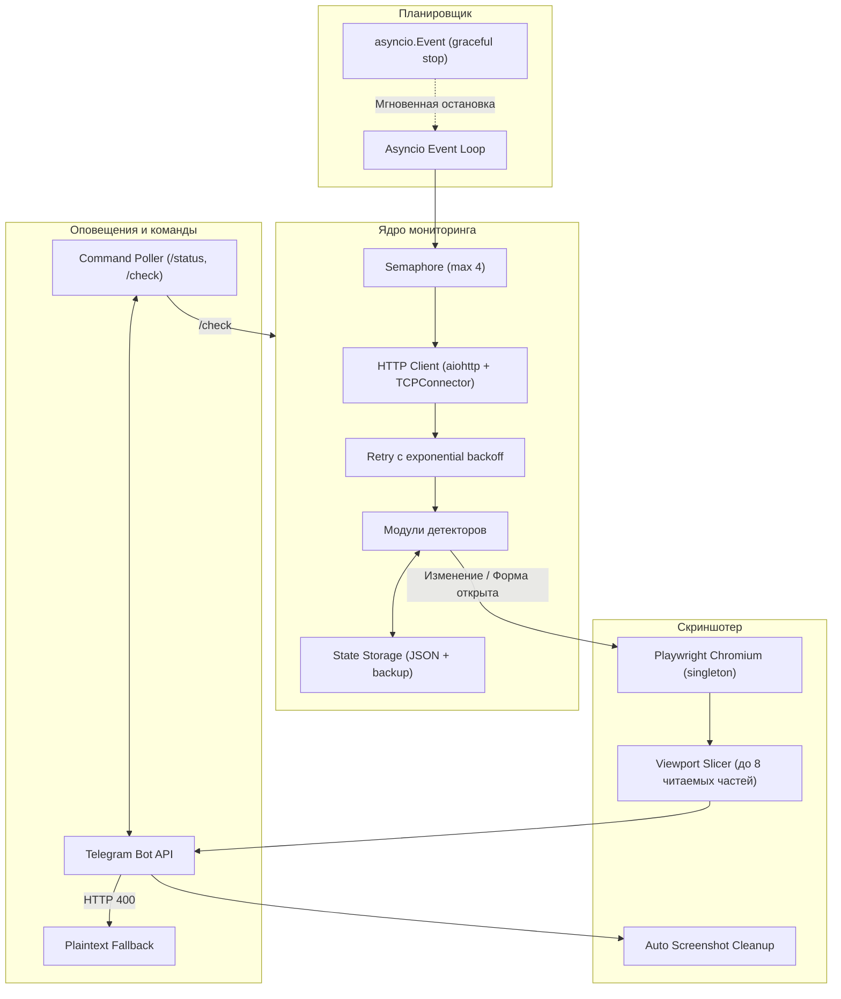

# Архитектура SWS Watcher

Документ описывает внутреннюю структуру, алгоритмы детекции и логику работы компонентов сервиса мониторинга.

---

## 1. Общая схема

Сервис построен на базе асинхронного цикла событий `asyncio`. Опрос целевых ресурсов выполняется параллельно через неблокирующий HTTP-клиент `aiohttp` с пулом соединений (`TCPConnector`) и семафором для ограничения параллельных запросов.

---

## 2. Компоненты системы

### HTTP Poller с Retry
* Опрос запускается каждые `N` секунд (настраивается через `CHECK_INTERVAL_SECONDS`).
* Для каждого запроса выставляются стандартные заголовки современного браузера.
* При временных сетевых сбоях (таймаут, 5xx, `ClientError`) выполняется до 3 повторных попыток с экспоненциальным backoff (2с, 4с, 8с).
* Параллельность ограничена семафором (`asyncio.Semaphore`) до 4 одновременных запросов.

### Пул соединений
* Единый экземпляр `aiohttp.ClientSession` с `TCPConnector(limit=20, limit_per_host=5, ttl_dns_cache=300)` создается при старте движка и переиспользуется на протяжении всего жизненного цикла.
* Этот же экземпляр сессии передается в `TelegramNotifier` для отправки алертов, избегая создания отдельных сессий на каждый вызов API.

### Модульные детекторы (`src/detectors/`)
Каждый целевой сайт обрабатывается специализированным классом-детектором. Маршрутизация выполняется через `TargetType` enum, а не через захардкоженные строковые идентификаторы:

1. **Google Forms (`GoogleFormsDetector`):**
   * Анализирует конечный URL после прохождения цепочки редиректов.
   * Сравнивает наличие признаков закрытой формы (`/closedform`, текст `nu mai accepta raspunsuri` / `no longer accepting responses`).
   * Проверяет наличие интерактивных полей ввода в DOM.
   * Единственный тип целей со строгим бинарным статусом `OPEN` / `CLOSED`. Остальные цели всегда находятся в статусе `WATCHING`.

2. **Best Opportunity Website (`BestOpportunityWebDetector`):**
   * Парсит HTML главной страницы и блока `/recrutare`.
   * Извлекает ссылки из тегов `<a>` и `<iframe>` на внешние формы (с фильтрацией пустых `src`).
   * Считает SHA-256 хэш текстового содержимого.
   * Триггерит алерт при появлении новых ссылок на регистрацию.

3. **HOPS Instructions (`HopsDetector`):**
   * Сканирует страницу инструкций по набору на предмет появления прямых ссылок на регистрационные порталы.
   * Вычисляет стабильный хэш текстового содержимого, предварительно очищая DOM от `<script>`, `<style>`, `<noscript>`, `<svg>`, `<header>`, `<footer>` для исключения ложных срабатываний от динамических элементов.
   * **Не использует поиск по ключевым словам** (слова типа "apply now", "registration" присутствуют на странице всегда и относятся к другим странам).

4. **Concordia UK (`ConcordiaDetector`):**
   * Отслеживает появление ссылок на форму сезонного набора для иностранных граждан.

### Движок скриншотов и дробление (`src/browser.py`)
* Запускает единственный экземпляр headless-браузера Chromium через Playwright при инициализации движка (singleton-паттерн).
* Для каждого скриншота создается легковесный `BrowserContext`, который закрывается в `finally`-блоке.
* Блокирует медиа и трекеры через `page.route()`, не блокируя стили и шрифты для корректного рендеринга.
* **Viewport slicing:** для длинных страниц (> 1400px) скриншотер автоматически дробит содержимое на читаемые слайсы ($1280 \times 900$ с перекрытием 100px и `device_scale_factor=1.25`). Максимум 8 слайсов, покрывающих 100% высоты.
* **Автоматическая очистка диска:** скриншоты удаляются с диска сразу после передачи в Telegram.

### Модуль нотификации и управления (`src/notifier.py`)
* Переиспользует общий `aiohttp.ClientSession` из движка мониторинга.
* Чтение файлов скриншотов с диска выполняется через `asyncio.to_thread()` для предотвращения блокировки event loop.
* **Интерактивные команды:**
  * `/status` — моментальный вывод текущего статуса отслеживаемых ресурсов.
  * `/check` — принудительный запуск полного цикла проверки со скриншотами.
  * `/archive` — принудительная отправка страниц в Wayback Machine.
  * `/help` — перечень доступных команд.
  * `/users` — просмотр белого списка (только для администратора).
  * `/revoke <id>` — отзыв доступа (только для администратора).
  * `/add <id>` — ручное добавление пользователя (только для администратора).
* Долгие операции (`/check`, `/archive`) запускаются через `asyncio.create_task()`, чтобы не блокировать polling loop и обработку команд от других пользователей.
* Обработчик входящих сообщений фильтрует `edited_message` и `callback_query`, обрабатывая только прямые сообщения от авторизованных пользователей.
* При ошибке парсинга HTML (HTTP 400) автоматически переключается на plaintext fallback.
* Отправляет уведомления при закрытии формы (`send_resolved`).

### Управление доступом (`src/whitelist.py`)
* При старте автоматически регистрирует `TELEGRAM_ADMIN_ID` из `.env` как главного администратора.
* Состояние белого списка хранится в `data/whitelist.json` с атомарной записью через `.tmp` → `replace`.
* **Механизм запроса доступа:**
  1. Неавторизованный пользователь отправляет любое сообщение боту.
  2. Бот уведомляет пользователя о принятии заявки и отправляет администратору интерактивное сообщение с inline-кнопками `[Одобрить]` и `[Отклонить]`.
  3. Повторные сообщения от того же пользователя до принятия решения игнорируются (защита от спам-флуда через `_pending_access_requests`).
  4. При одобрении пользователь автоматически начинает получать все алерты и доступ ко всем командам.
* Главный администратор не может быть отозван через `/revoke`.

### Wayback Machine Archiver (`src/archiver.py`)
* Автоматически 2 раза в сутки (каждые `WAYBACK_INTERVAL_HOURS`, по умолчанию 12 часов) отправляет все целевые URL-адреса на архивацию через `https://web.archive.org/save/`.
* Первая архивация выполняется сразу при старте бота (таймер инициализируется в прошлом).
* Между запросами выдерживается пауза 2 секунды для соблюдения fair-use лимитов Internet Archive.
* Таймауты Wayback Machine (30с) обрабатываются корректно: серверная очередь продолжает обработку в фоне.
* Ручной запуск по команде `/archive` с доставкой результатов в чат запросившего пользователя.

---

## 3. Хранение состояния

Текущее состояние отслеживаемых ресурсов сохраняется в `data/monitor_state.json`.

Механизм защиты от повреждения:
1. Перед каждой записью создается резервная копия `monitor_state.json.bak`.
2. Запись выполняется атомарно через временный файл (`.tmp`) с последующим `replace`.
3. При обнаружении повреждения основного файла автоматически загружается бэкап.

---

## 4. Отказоустойчивость

* **Retry с backoff:** до 3 попыток с экспоненциальной задержкой при сетевых сбоях.
* **Semaphore:** ограничение параллельных запросов для предотвращения перегрузки.
* **Graceful shutdown:** по сигналам `SIGINT`/`SIGTERM` движок мгновенно прерывает цикл ожидания через `asyncio.Event`, закрывает Playwright, сессию и фоновый опрос команд.
* **Silent baseline:** при запуске или перезапуске контейнера первый цикл проверки выполняется бесшумно, без отправки уведомлений, чтобы зафиксировать текущее состояние ресурсов.
* **State backup:** автоматическое резервное копирование предотвращает ложные массовые алерты при повреждении файла состояния.
* **CancelledError re-raise:** корректная обработка отмены задач в asyncio без подавления сигналов.
