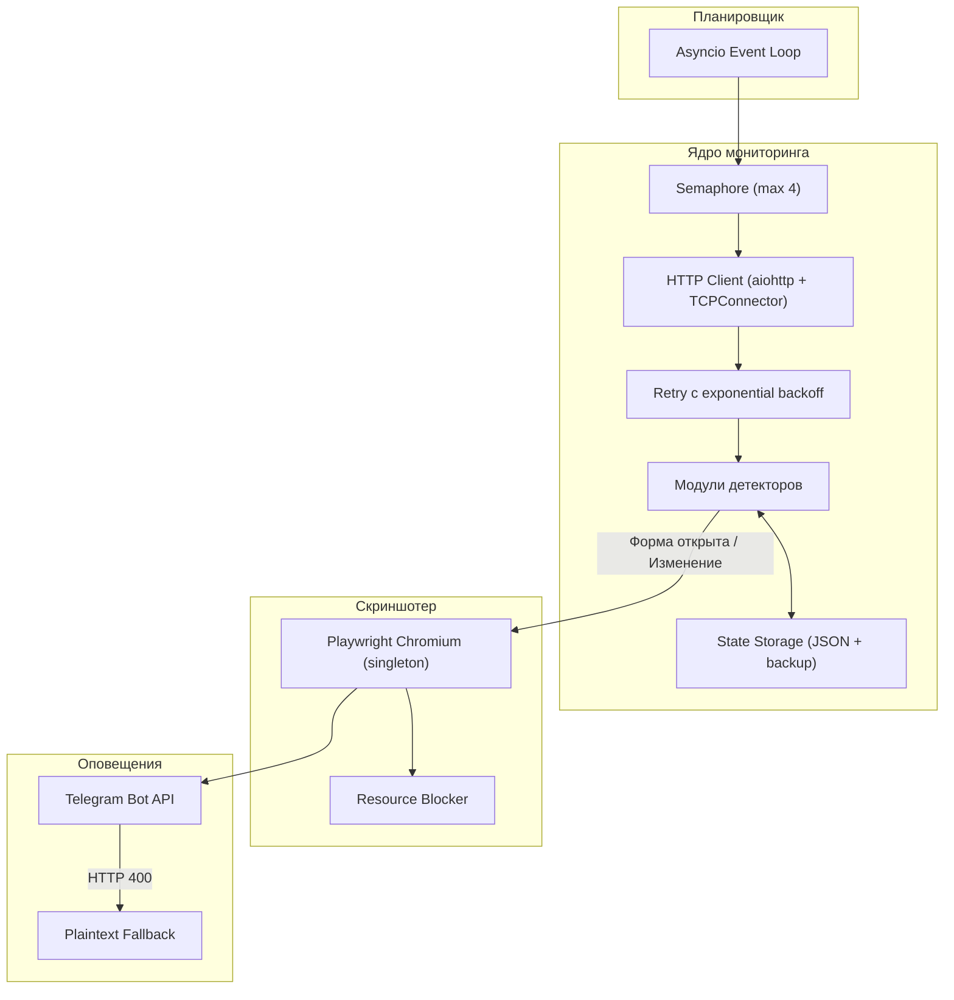

# Архитектура SWS Watcher

Документ описывает внутреннюю структуру, алгоритмы детекции и логику работы компонентов сервиса мониторинга.

---

## 1. Общая схема

Сервис построен на базе асинхронного цикла событий `asyncio`. Опрос целевых ресурсов выполняется параллельно через неблокирующий HTTP-клиент `aiohttp` с пулом соединений (`TCPConnector`) и семафором для ограничения параллельных запросов.

---

## 2. Компоненты системы

### HTTP Poller с Retry
* Опрос запускается каждые `N` секунд (настраивается через `CHECK_INTERVAL_SECONDS`).
* Для каждого запроса выставляются стандартные заголовки современного браузера.
* При временных сетевых сбоях (таймаут, 5xx, `ClientError`) выполняется до 3 повторных попыток с экспоненциальным backoff (2с, 4с, 8с).
* Параллельность ограничена семафором (`asyncio.Semaphore`) до 4 одновременных запросов.

### Пул соединений
* Единый экземпляр `aiohttp.ClientSession` с `TCPConnector(limit=20, limit_per_host=5, ttl_dns_cache=300)` создается при старте движка и переиспользуется на протяжении всего жизненного цикла.
* Этот же экземпляр сессии передается в `TelegramNotifier` для отправки алертов, избегая создания отдельных сессий на каждый вызов API.

### Модульные детекторы (`src/detectors/`)
Каждый целевой сайт обрабатывается специализированным классом-детектором:

1. **Google Forms (`GoogleFormsDetector`):**
   * Анализирует конечный URL после прохождения цепочки редиректов.
   * Сравнивает наличие признаков закрытой формы (`/closedform`, текст `nu mai accepta raspunsuri` / `no longer accepting responses`).
   * Проверяет наличие интерактивных полей ввода в DOM.
   * Статус считается `OPEN`, если редирект ведет на `/viewform` и в DOM присутствуют активные элементы формы.

2. **Best Opportunity Website (`BestOpportunityWebDetector`):**
   * Парсит HTML главной страницы и блока `/recrutare`.
   * Извлекает ссылки на внешние формы и встроенные `iframe`.
   * Считает SHA-256 хэш текстового содержимого.
   * Триггерит событие при появлении новых ссылок на регистрацию.

3. **HOPS Instructions (`HopsDetector`):**
   * Сканирует страницу инструкций по набору на предмет появления прямых ссылок на регистрационные порталы.
   * Выполняет regex-поиск по ключевым словам (`Moldova`, `apply now`, `season 2026` и др.).
   * Отслеживает изменения хэша текста страницы.

4. **Concordia UK (`ConcordiaDetector`):**
   * Отслеживает появление ссылок на форму сезонного набора для иностранных граждан.

### Движок скриншотов (`src/browser.py`)
* Запускает единственный экземпляр headless-браузера Chromium через Playwright при инициализации движка (singleton-паттерн).
* Для каждого скриншота создается легковесный `BrowserContext`, который закрывается в `finally`-блоке.
* Блокирует тяжелые ресурсы (изображения, шрифты, медиа, аналитика) через `page.route()` для ускорения загрузки.
* Использует `--disable-blink-features=AutomationControlled` для обхода простых bot-детекторов.
* Ожидает `networkidle` с таймаутом 5с после `domcontentloaded` вместо хардкоженного `sleep`.

### Модуль нотификации (`src/notifier.py`)
* Переиспользует общий `aiohttp.ClientSession` из движка мониторинга.
* Формирует HTML-сообщение с описанием события и ссылкой на целевой ресурс.
* Отправляет скриншот через `sendPhoto` (multipart/form-data) с inline-кнопкой.
* При ошибке парсинга HTML (HTTP 400) автоматически переключается на plaintext fallback.
* Трансакт текстовых сообщений до лимита Telegram (4096 символов), подписи к фото до 1024 символов.
* Отправляет уведомления при закрытии формы (`send_resolved`).

---

## 3. Хранение состояния

Текущее состояние отслеживаемых ресурсов сохраняется в `data/monitor_state.json`.

Механизм защиты от повреждения:
1. Перед каждой записью создается резервная копия `monitor_state.json.bak`.
2. Запись выполняется атомарно через временный файл (`.tmp`) с последующим `replace`.
3. При обнаружении повреждения основного файла автоматически загружается бэкап.

---

## 4. Отказоустойчивость

* **Retry с backoff:** до 3 попыток с экспоненциальной задержкой при сетевых сбоях.
* **Semaphore:** ограничение параллельных запросов для предотвращения перегрузки.
* **Graceful shutdown:** по сигналам `SIGINT`/`SIGTERM` движок завершает текущий цикл, закрывает Playwright, сессию и нотификатор.
* **State backup:** автоматическое резервное копирование предотвращает ложные массовые алерты при повреждении файла состояния.
* **CancelledError re-raise:** корректная обработка отмены задач в asyncio без подавления сигналов.
